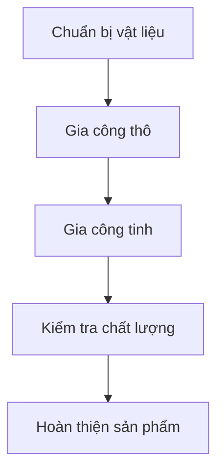
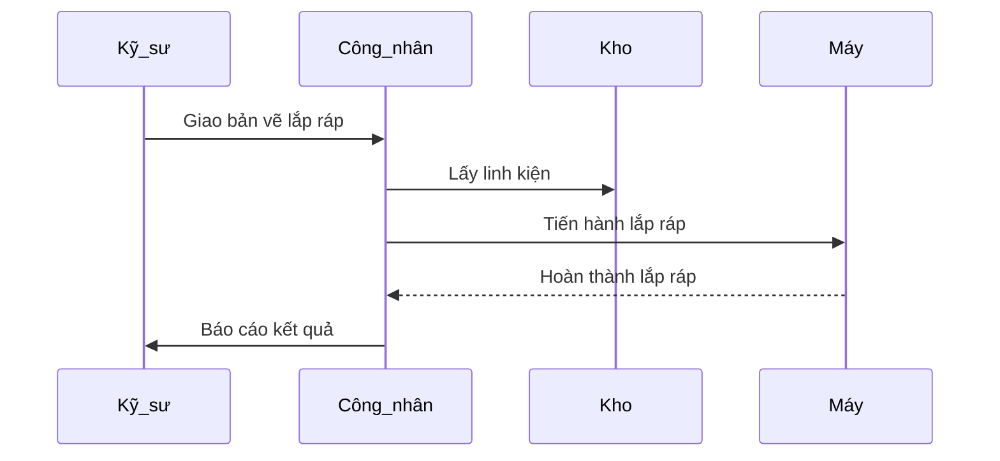

Trang web này hỗ trợ kỹ sư cơ khí trình bày thông tin kỹ thuật, kết quả đo đạc và quy trình sản xuất một cách trực quan, dễ hiểu. Bạn chỉ cần tập trung vào nội dung chuyên môn, hệ thống sẽ hỗ trợ phần trình bày.

Các công cụ như Plotly, Mermaid và bảng dữ liệu giúp minh họa các thông số, quy trình hoặc kết quả kiểm tra trong lĩnh vực cơ khí.

## Biểu đồ kỹ thuật

Sử dụng [Plotly](https://plot.ly/) để tạo các biểu đồ tương tác như biểu đồ lực, biểu đồ ứng suất, biểu đồ nhiệt độ hoặc biểu đồ mô phỏng chuyển động.

Lưu file JSON biểu đồ (ví dụ `force-chart.json`) vào thư mục bài viết, sau đó chèn shortcode `` vào vị trí mong muốn.

Ví dụ:



Bạn có thể sử dụng [Plotly JSON Editor](http://plotly-json-editor.getforge.io/) để chỉnh sửa biểu đồ theo nhu cầu.

## Sơ đồ quy trình và cấu trúc

Markdown hỗ trợ mở rộng _Mermaid_ để vẽ sơ đồ quy trình sản xuất, sơ đồ lắp ráp, hoặc sơ đồ cấu trúc máy móc.

Ví dụ **sơ đồ quy trình sản xuất**:



Ví dụ **sơ đồ lắp ráp thiết bị**:



## Bảng dữ liệu kỹ thuật

Lưu bảng dữ liệu (ví dụ kết quả đo đạc, thông số vật liệu) dưới dạng file CSV trong thư mục bài viết, sau đó sử dụng shortcode _Table_ để hiển thị:

```go

```

Kết quả:



---

Nếu bạn thấy nội dung hữu ích, hãy chia sẻ cho đồng nghiệp trong ngành cơ khí! 🚀
