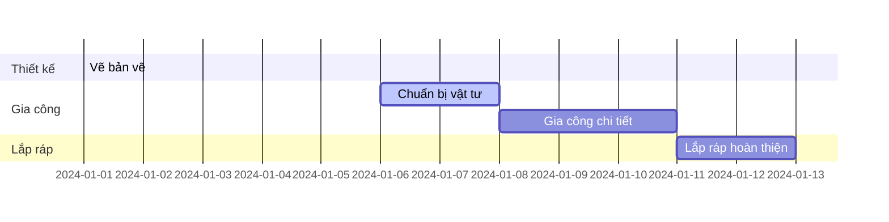

Quản lý dự án cơ khí dễ dàng - lập sơ đồ ý tưởng, biểu đồ Gantt, danh sách công việc và nhiều hơn nữa!

## Lên ý tưởng

Bạn có thể sử dụng Markdown để tạo sơ đồ ý tưởng (mindmap) cho các dự án cơ khí.

Chỉ cần chèn một khối mã Markdown với nhãn `markmap` và viết các ý tưởng dưới dạng danh sách, ví dụ:

<div class="highlight">
<pre class="chroma">
<code>
```markmap {height="200px"}
- Dự án chế tạo máy
  - Thiết kế bản vẽ
  - Lập danh sách vật tư
  - Gia công chi tiết
  - Lắp ráp hoàn thiện
```
</code>
</pre>
</div>

hiển thị như

```markmap {height="200px"}
- Dự án chế tạo máy
  - Thiết kế bản vẽ
  - Lập danh sách vật tư
  - Gia công chi tiết
  - Lắp ráp hoàn thiện
```

## Biểu đồ tiến độ

Markdown hỗ trợ _Mermaid_ để vẽ biểu đồ tiến độ (Gantt chart) cho dự án cơ khí.

Ví dụ về **biểu đồ Gantt**:

    ```mermaid
    gantt
    section Thiết kế
    Vẽ bản vẽ :done,    des1, 2024-01-01,2024-01-05
    section Gia công
    Chuẩn bị vật tư :active, des2, 2024-01-06, 2d
    Gia công chi tiết :      des3, after des2, 3d
    section Lắp ráp
    Lắp ráp hoàn thiện :    des4, after des3, 2d
    ```

hiển thị như



## Danh sách công việc

Bạn cũng có thể viết danh sách công việc cho dự án cơ khí bằng Markdown:

```markdown
- [x] Hoàn thành bản vẽ thiết kế
  - [x] Kiểm tra thông số kỹ thuật
- [ ] Mua vật tư
- [ ] Gia công chi tiết
- [ ] Lắp ráp và kiểm tra
```

hiển thị như

- [x] Hoàn thành bản vẽ thiết kế
  - [x] Kiểm tra thông số kỹ thuật
- [ ] Mua vật tư
- [ ] Gia công chi tiết
- [ ] Lắp ráp và kiểm tra

## Bạn thấy trang này hữu ích? Hãy chia sẻ nhé! 🙌

